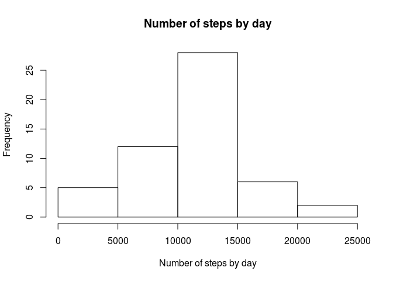
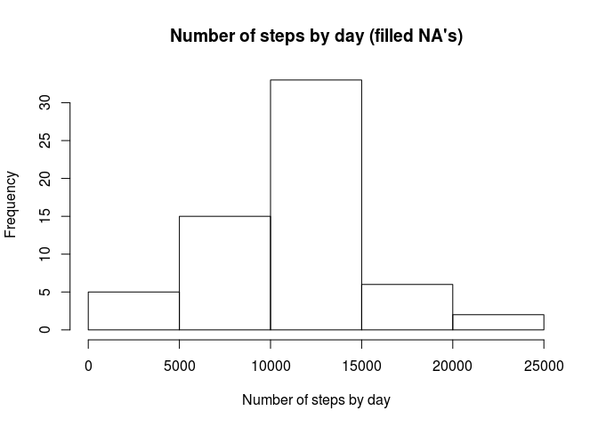

## Loading and preprocessing the data


```r
if(!file.exists("activity.csv")){
  unzip("activity.zip")
}
mydata <- read.csv("activity.csv")
mydata$date <- as.Date(mydata$date)
cleandata <- mydata[!is.na(mydata$steps),]
Sys.setlocale("LC_ALL", "en_GB.UTF-8")
```

## What is mean total number of steps taken per day?

Histograms of the number of steps by day:

```r
stepsbyday <- aggregate(cleandata$steps, by = list(date=cleandata$date), FUN = sum)
plot(stepsbyday$date, stepsbyday$x, type = "h", xlab = "Date", ylab = "Number of steps")
```

<!-- -->

```r
meansteps <- mean(stepsbyday$x)
mediansteps <- median(stepsbyday$x)
```

The mean and median number of steps by day are, repectively, 10766.19 and 10765.

## What is the average daily activity pattern?


```r
avgstepsby5min <- aggregate(cleandata$steps, by = list(interval=cleandata$interval), FUN = mean)
plot(avgstepsby5min$interval, avgstepsby5min$x, type = "l", xlab = "Interval", ylab = "Average number of steps")
```

<!-- -->

```r
maxavginterval <- avgstepsby5min[avgstepsby5min$x == max(avgstepsby5min$x), "interval"]
```

The interval with the maximum average number of steps is 835.

## Imputing missing values


```r
nas <- sum(is.na(mydata$steps))
```
The number of missing values is 2304.

The choice was made to fill the NA's value by the average by day of the week and by interval of time assuming activities depend mainly on the day of the week.
Values are rounded to have a finite number of steps for each intervals. 

```r
mydata$weekday <- weekdays(mydata$date)
byweekday <- aggregate(mydata$steps, by = list(weekday = mydata$weekday, interval=mydata$interval), FUN = mean, na.rm = TRUE)
library(plyr)
newdata <- join(mydata, byweekday)
```

```
## Joining by: interval, weekday
```

```r
newdata[is.na(newdata$steps),"steps"] <-newdata[is.na(newdata$steps), "steps"<-"x"]
newdata$steps <- round(newdata$steps)
newdata$x <- NULL
```

Checking new data:

```r
newstepsbyday <- aggregate(newdata$steps, by = list(date=newdata$date), FUN = sum)
plot(newstepsbyday$date, newstepsbyday$x, type = "h", xlab = "Date", ylab = "Number of steps")
```

<!-- -->

```r
newmeansteps <- mean(newstepsbyday$x)
newmediansteps <- median(newstepsbyday$x)
```
The new mean and median number of steps by day are, repectively, 10821.1 and 11015.
These numbers are slightly higher than those found previously ignoring NA's.
This shows that imputing missing values can be risky as it can lead to differences on the analysis results.
Better be sure on the assumption made for doing it and you have to assign some systematic uncertainties on this assumption.

## Are there differences in activity patterns between weekdays and weekends?

Plots to compare activity during weekdays and weekends:

```r
newdata$weekpart <- factor(sapply(newdata$weekday, function(x) ifelse(x %in% c("Saturday","Sunday"), "weekend", "weekday")))
byweekpart <- aggregate(newdata$steps, by = list(weekpart = newdata$weekpart, interval=newdata$interval), FUN = mean)
library(ggplot2)
qplot(interval, x, data = byweekpart, facets = weekpart ~ ., geom = 'line', ylab = "Average number of steps")
```

<!-- -->

Differences are observed with a "flatter" activity during the weekends.
